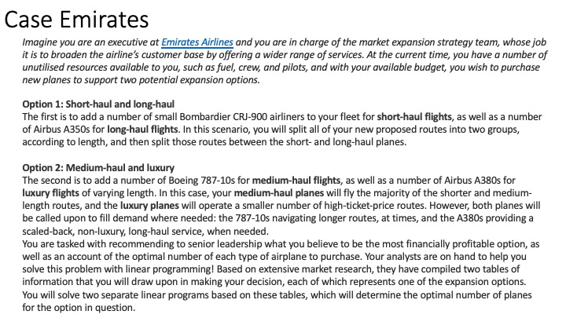
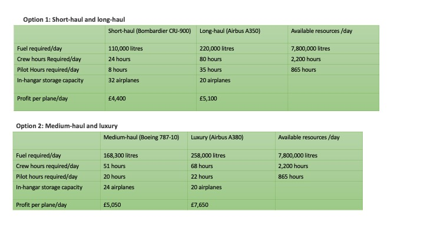
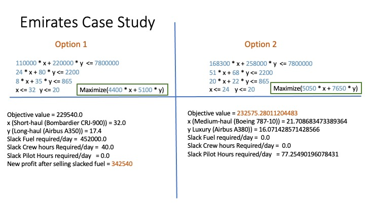

## Linear programing (LP)
This example explore Linear Programing using Emirates case study. LP is implemented using OR Tools

### Case Study

### Outcome

###
Following file are implementation of option 1 and option 2
- emirates-option1.py
- emirates-option1.py